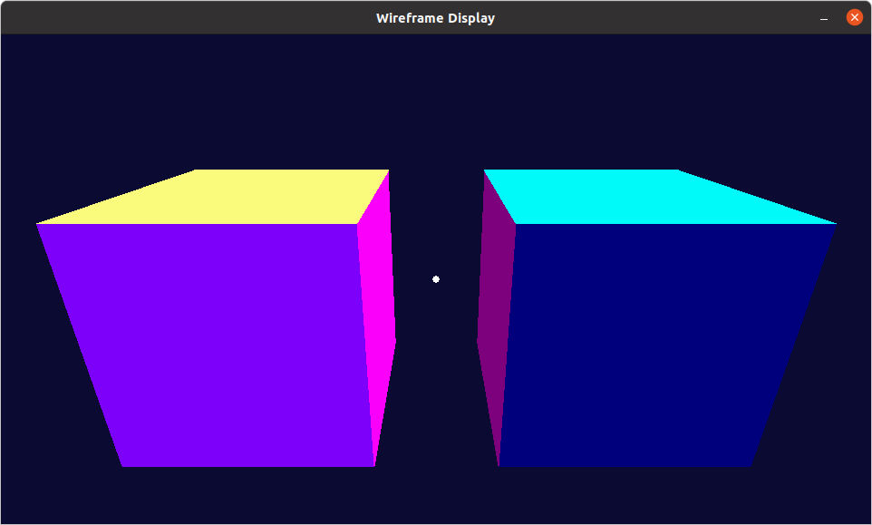
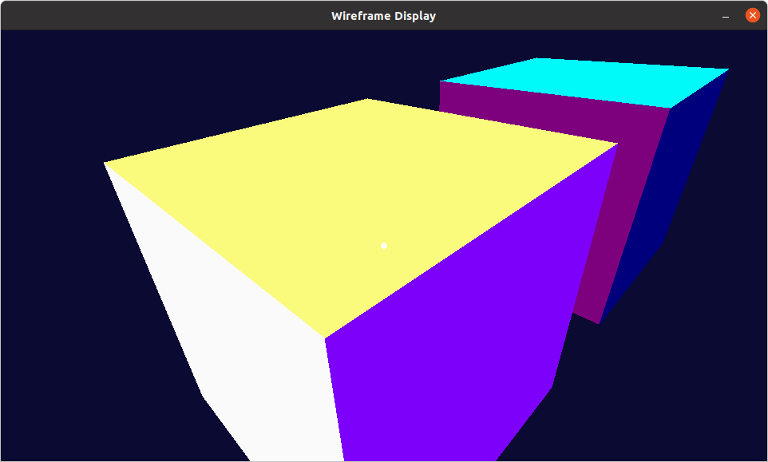
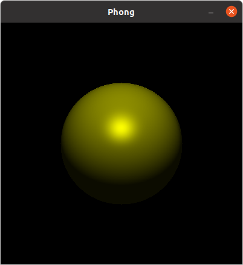
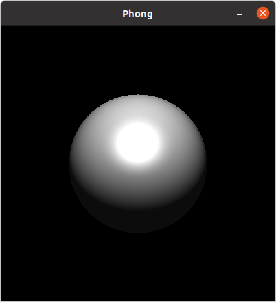
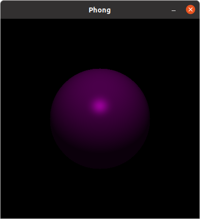
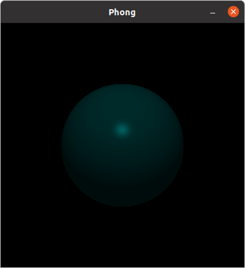

These are my programs for computer graphics in my third year of college.

Both programs written in Python, using numpy vectoring for optimization.

3-Camera
==================

TThe first program is a 3d camera moving between solids. To solve the obstruction problem I used the painting algorithm. First I sort the walls according to Z coordinates, then based on the plane equation I check which should be displayed first and which last.

Sample views 
===================

Phong's algorithm.
==================

The second program displays the reflection of light from the sphere depends on the parameters of the sphere and the intensity of the light and the angle of incidence.
Sample views 
===================

